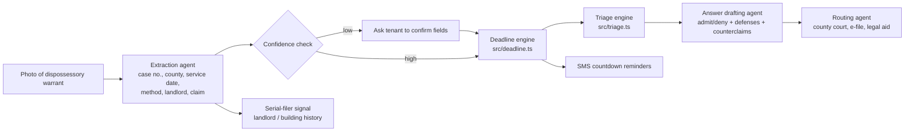

# DocketShield Architecture

## Problem, in numbers

- Metro Atlanta landlords filed about **144,000 evictions** in a year, the **highest eviction-filing rate in the US**: 24 per 100 renter households, about **3x the national average** (Eviction Lab data, reported by FOX 5 Atlanta).
- Roughly **15% of metro evictions come from just 100 buildings**, a small set of serial filers.
- In Georgia, a tenant has **7 days** after service to file an Answer. Miss it and the landlord may seek removal on **day 8** (Fulton County Magistrate Court Tenant Pamphlet).

The failure point is not the law. It is time, confusion, and a single wrong date.

## Agent pipeline

| Stage | Status | Guarantee |
|---|---|---|
| Deadline engine | **Built, 10 tests** | Exact Georgia rollover; fails closed on unverified calendars |
| Triage engine | **Built, 7 tests** | Only court-recognized options; unknown facts produce nothing |
| Extraction agent | Planned | Every extracted field shown to the tenant before use |
| Answer drafting | Planned | Output is a draft for the tenant or legal aid to review, never auto-filed |
| Routing | Planned (Fulton first) | County data sourced from each Magistrate Court |
| Serial-filer signal | Planned | Built on public filing data only |

## Design principles

1. **Correct beats clever.** A deadline that is off by one day is worse than no tool. Dates are pinned by tests against hand-checked cases.
2. **Every rule cites its source.** `src/rules/sources.ts` is the single registry.
3. **Fail closed.** When the engine cannot be sure, it says so and points to the papers and the clerk.
4. **Information, not advice.** The product routes people to free lawyers; it does not replace them.

## Roadmap to WarriorHacks submission (Oct 13, 11:45 PM CT)

1. Extraction agent on real sample warrants (redacted, synthetic data only in the repo).
2. Tenant-facing mobile-first flow: upload → confirm facts → deadline countdown → options → draft Answer → where to file.
3. Fulton County routing, then DeKalb, Cobb, Clayton, Gwinnett with sourced court data.
4. Demo video and Devpost write-up.
