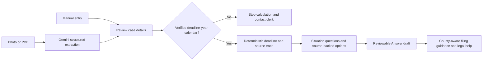

# DocketShield architecture

## Implemented flow

The extraction API marks every field for review. In the app, each scanned or sample field needs explicit checkbox confirmation, including blanks. Editing a confirmed field clears that confirmation. Deadline checks are recalculated from the edited values rather than trusting the initial extraction message.

## Current status

| Stage | Status | Boundary |
|---|---|---|
| Extraction | Implemented with model fallback | Gemini-generated values, confidence, and evidence require human review |
| Deadline | Implemented | Verified 2026 calendar only; unsupported years stop calculation |
| Triage | Implemented | Deterministic rules based on supplied facts |
| Draft | Implemented | Template-based, for review; never auto-filed |
| Tenant app | Implemented | Guided mobile web flow and sample case |
| Filing guidance | Implemented, Fulton details | Other counties use their summons and clerk; no automatic Fulton routing |
| SMS reminders | Planned | No claim of delivery |
| Serial-filer analysis | Planned | No public-data pipeline implemented |
| Independent legal validation | Pending | Automated tests do not replace outside review |

## Code boundaries

- src/extract.ts: model response normalization and document/deadline comparison.
- src/deadline.ts and src/rules/holidays.ts: calendar arithmetic and verified holiday data.
- src/triage.ts: options derived from supplied facts.
- src/answer.ts and src/rules/answerForm.ts: draft text and its source templates.
- src/rules/sources.ts: source registry.
- api/: Vercel HTTP endpoints; errors preserve unsupported-calendar explanations.
- Separate docketshield-app repository: confirmation UI, API schemas, draft display, and county-aware filing guidance.

## Submission preparation

Confirm the current WarriorHacks rules and deadline from the organizer. The previously documented date was not independently verified.

Before claiming readiness: run CI, exercise the real deployed scan and manual journeys, review supported rules with a qualified Georgia housing-law reviewer, and record a demonstration showing both a successful case and an uncertainty case. See VALIDATION.md.
